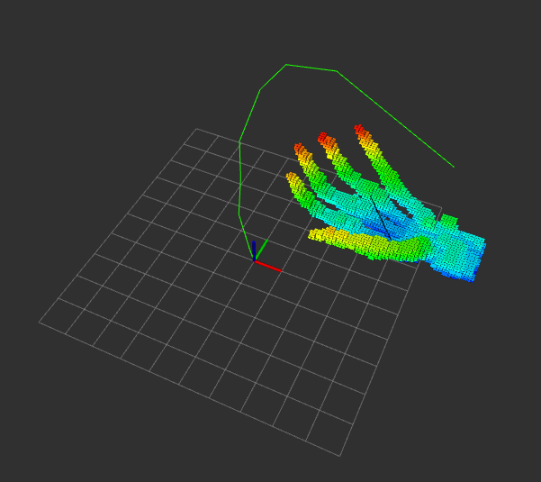
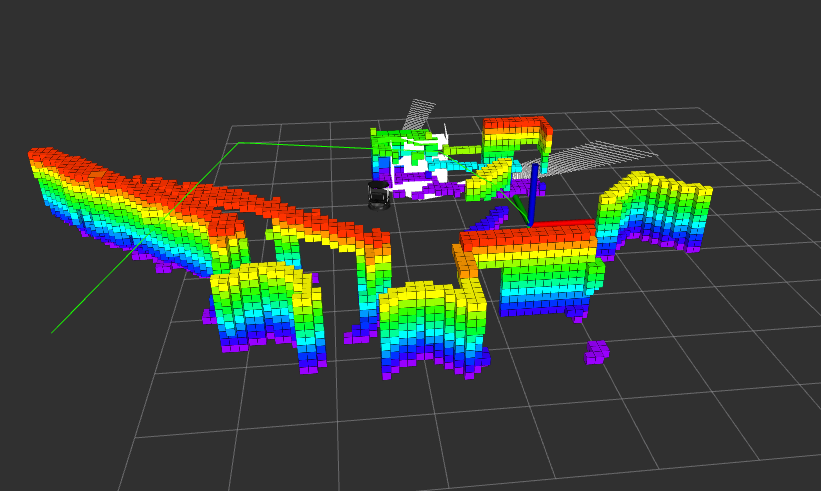

**1**.在``setStart``和``setGoal``设置Z值相同的情况下，规划的路径在Z轴方向也会发生波动，不过波动不大。

## DONE

#### 2019.8.30:

1.点云地图转换成八叉树，并在RVIZ上显示；

2.``path_planning.cpp``可以订阅``october_msgs``,规划处可以避开障碍物的全局路径；

3.显示path的是nav_msgs，显示trajectory可以安装下moveit-ros-visualization;

##### 2019.8.31
turtlebot：

#### 2019.9.4

1. pinocchio提供contact dynamics 确保geometric model与surface接触；
2. Geometrical objects are stored using a modified version of FCL. We thus rely on this library for distance and collision computations.
3. HPP: hpp_model; hpp_constraint; hpp_core.

#### 2019.9.6

hpp-rbprm是HPP Library的一个demo！ 先看HPP，再看demo；

``rbprm-device.cc``
``rbprm-rom-validation.cc``

**Hpp和OMPL一样，也是运动规划的库，但是HPP更加全面，性能更好！**
## TODO

#### 2019.8.30

1.利用``goalpoint_transformer.cpp``在rviz上发布start、goal消息；**√√√**

2.规划路径的约束：

``1`` 机器人与障碍物需要有重合部分:``Pinocchio``  
``1.1``利用pcl碰撞检测算法原理：``FCL``
``1.2``首先找到需要重合的一些点：``Hpp_affordance``
``2`` 路径搜索范围自定义设置；
``3`` 如何建三维点云地图，WQ推荐Categorapher（搁置）;

#### 2019.9.3
``1`` HPP library
``1`` FCL library
``1`` Pinocchio library

**这三个库非常重要，要看明白啊！**

#### 2019.9.6

``1``安装好hpp-rbprm, 先跑一跑脚本例子；
``2``搞明白里面的C++
